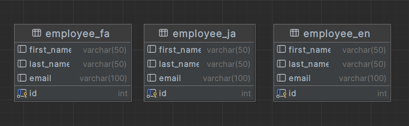
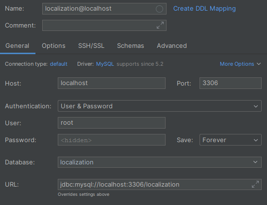
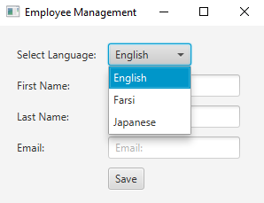
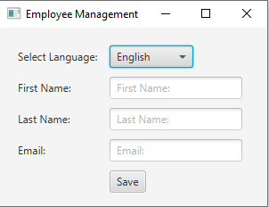
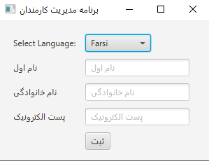
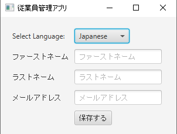
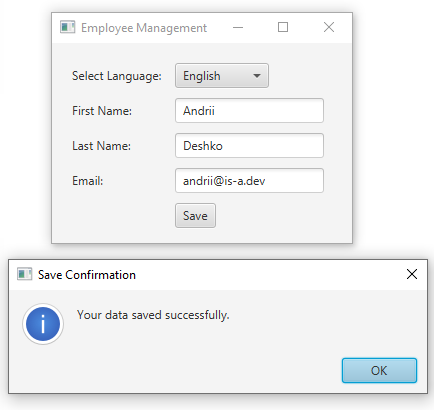
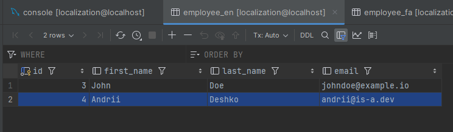

# Localized Data Application
___

This JavaFX application lets user interact with a localized database, 
that support various languages such as Farsi, Japanese and English.

## Features

- **Multilingual Interface**: The interface adjusts messages, labels, and database operations dynamically according to the UI language selected by the user.
- **Localized Database**: Utilizes language-specific tables `employee_fa`, `employee_ja`, `employee_en` to store and retrieve localized data.
- **User Interaction**: User can add new data records to the database, with the interface and database functionalities aligning with the chosen language.

## Database Structure

The application has three tables, each designated for one of the supported languages. Each language specific "employee" table contain fields for ID, first name, last name, and email.


## Setup

To set up the application, ensure you have JDK 17+, MySQL Server, and Maven installed. 

Follow the steps to create a localized database and initialize it with the required tables.

- Create MySQL database. Make sure your DB settings look similar to this:


- Use your own `DB_URL`, `DB_USER`, `DB_PASSWORD` credentials and replace those in `src/main/java/org/example/localizingdb/LocalizedDB.java` file
on lines 22-24. Credentials are not in `.env` file for demo purposes. 


- In your database console, insert and execute following commands:
```mysql
CREATE TABLE employee_en
(
    id         INT AUTO_INCREMENT PRIMARY KEY,
    first_name VARCHAR(50),
    last_name  VARCHAR(50),
    email      VARCHAR(100)
);

CREATE TABLE employee_fa
(
    id         INT AUTO_INCREMENT PRIMARY KEY,
    first_name VARCHAR(50),
    last_name  VARCHAR(50),
    email      VARCHAR(100)
);

CREATE TABLE employee_ja
(
    id         INT AUTO_INCREMENT PRIMARY KEY,
    first_name VARCHAR(50),
    last_name  VARCHAR(50),
    email      VARCHAR(100)
);
```
Now your DB is set up.

- Run the `LocalizedDB.java` class to launch the application.

## Usage

- Select the desired language from the "Language" dropdown




- User interface changes based on the language selected

<br/>
<br/>
<br/>

- Sample input data into DB in English



- Input data is stored in the `employee_en` table in the database.



## Dependencies

- **JavaFX**: Required for displaying application's GUI.
- **MySQL Connector/J**: Essential for establishing connectivity with the MySQL database server.
